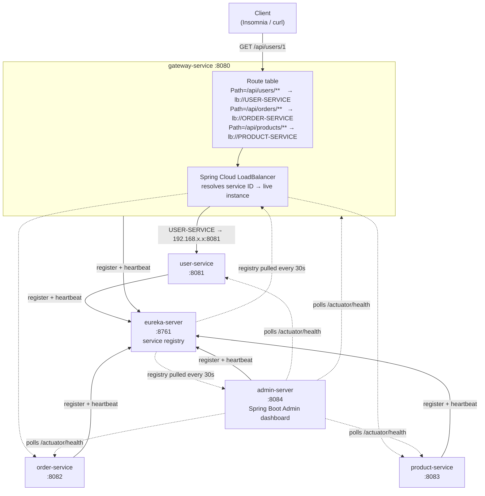
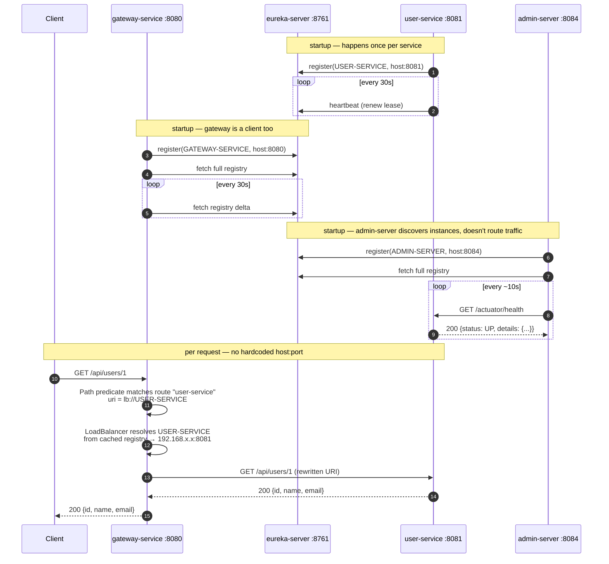
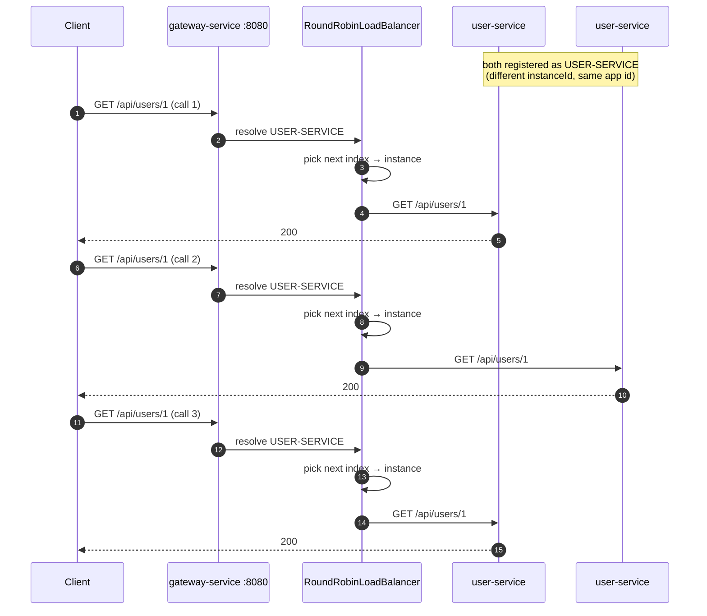
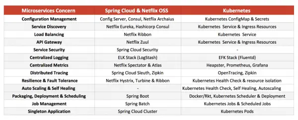

# <span style="color:hsl(13,68%,44%)">learning-service-discovery</span>

## <span style="color:hsl(43,68%,32%)">Table of contents</span>

1. 🧩 [Modules](#modules)
2. 🔎 [How the gateway finds services via Eureka](#how-the-gateway-finds-services-via-eureka)
3. 🏗️ [Parent / BOM chain](#parent--bom-chain)
4. 🚀 [Run order](#run-order)
5. ✅ [Verify](#verify)
6. 🧪 [Tests](#tests)
7. ❓ [FAQ](#faq)
8. 🗺️ [Where this fits: Spring Cloud/Netflix OSS vs Kubernetes](#where-this-fits)

Eureka service discovery demo. 6 Maven modules: 1 Eureka registry + 3 REST
microservices + 1 API gateway + 1 Spring Boot Admin dashboard, all registering
with the registry.

<a id="modules"></a>
## <span style="color:hsl(73,68%,32%)">1. 🧩 Modules</span>

| Module            | Port | Role                          | REST API                          | Swagger UI                              |
|-------------------|------|--------------------------------|------------------------------------|------------------------------------------|
| `eureka-server`   | 8761 | Service registry / dashboard  | —                                   | —                                        |
| `user-service`    | 8081 | Eureka client                 | `GET /api/users`, `GET /api/users/{id}`       | http://localhost:8081/swagger-ui.html    |
| `order-service`   | 8082 | Eureka client                 | `GET /api/orders`, `GET /api/orders/{id}`, `GET /api/orders/{id}/with-user` (calls `user-service` directly, load-balanced, no gateway) | http://localhost:8082/swagger-ui.html    |
| `product-service` | 8083 | Eureka client                 | `GET /api/products`, `GET /api/products/{id}` | http://localhost:8083/swagger-ui.html    |
| `gateway-service` | 8080 | Eureka client + API gateway    | routes `/api/users/**`, `/api/orders/**`, `/api/products/**` to the 3 services above via `lb://` | —          |
| `admin-server`    | 8084 | Spring Boot Admin — discovers instances via Eureka, dashboard at http://localhost:8084 | — | — |

<a id="how-the-gateway-finds-services-via-eureka"></a>
## <span style="color:hsl(103,68%,32%)">2. 🔎 How the gateway finds services via Eureka</span>

`gateway-service` never hardcodes a backend host or port. It is itself a
Eureka client (same `eureka.client.service-url.defaultZone` as the other 3
modules) and its routes point at a **service ID**, not a URL:

```yaml
spring:
  cloud:
    gateway:
      server:
        webflux:
          routes:
            - id: user-service
              uri: lb://USER-SERVICE      # not http://host:port
              predicates:
                - Path=/api/users/**
```

`lb://` is the load-balanced URI scheme. At request time Spring Cloud
LoadBalancer's `ReactiveLoadBalancerClientFilter` resolves `USER-SERVICE`
against the gateway's local Eureka registry cache (refreshed every 30s by
default), picks a live instance, and rewrites the URI to that instance's real
`host:port` before forwarding. Introspect the resolved routes at
`http://localhost:8080/actuator/gateway/routes`.



`admin-server` isn't part of the request path above — it's a separate observer.
It discovers the same instances via the same Eureka registry (`DiscoveryClient`,
no manual registration list), then polls each one's `/actuator/health` on its
own schedule to drive the dashboard. See the
[Spring Boot Admin](#spring-boot-admin) section below for what it adds over
the raw Eureka dashboard.



Because resolution happens per-request against the cached registry, a
service can restart on a different host/port and the gateway keeps routing
correctly — no gateway config change needed, just the next registry refresh.

<a id="spring-boot-admin"></a>
### <span style="color:hsl(133,68%,32%)">Spring Boot Admin: discovery vs. the raw Eureka dashboard</span>

`eureka-server`'s own dashboard (`/`) shows what's registered and its lease
state — up/down, instance count, renewal timestamps. `admin-server` adds a
per-instance operational view on top of the same registry: live `/env`,
`/metrics`, `/loggers` (change a package's log level at runtime, no restart),
`/threaddump`, `/heapdump`, `/mappings`, `/beans`, `/configprops`, and a
"Journal" tab logging every status transition it has observed. It never
receives a manually-configured instance list — `EurekaDiscoveryClient` feeds
it the same registry `gateway-service`'s `LoadBalancer` reads, so any
service that registers with Eureka shows up in Admin automatically, no
`admin-server` config change needed.

One asymmetry: `eureka-server` itself never appears in `admin-server`'s
dashboard. It has `register-with-eureka: false` (see [§FAQ](#faq)) — it's
the registry, not a client of it — so there's no registration for
`admin-server` to discover it by.

### <span style="color:hsl(163,68%,36%)">Load balancing across multiple instances of the same service</span>

Run a second `user-service` instance on a different port (e.g.
`mvn -pl user-service spring-boot:run -Dspring-boot.run.arguments=--server.port=8091`)
and both register under the same Eureka app ID, `USER-SERVICE`, as two
separate `instanceId`s. `lb://USER-SERVICE` now resolves to a 2-instance
pool, and the default `RoundRobinLoadBalancer` alternates between them,
one call at a time, no stickiness:



Verify it yourself: `curl http://localhost:8761/eureka/apps/USER-SERVICE`
shows both instances under one `<application>`; then hit
`curl http://localhost:8080/api/users` a few times in a row and watch the
port in each `user-service` log line alternate.

<a id="parent--bom-chain"></a>
## <span style="color:hsl(193,68%,36%)">3. 🏗️ Parent / BOM chain</span>

```
super-pom (com.org.llm:super-pom:1.0.0)   ← corporate parent, imports learning-bom
  └── learning-service-discovery (com.learning:learning-service-discovery)  ← this repo's root pom, packaging=pom
        ├── eureka-server
        ├── user-service
        ├── order-service
        ├── product-service
        └── gateway-service
```

- Root `pom.xml` declares `super-pom` as `<parent>`. `super-pom` imports
  `learning-bom` in its `dependencyManagement`.
- `learning-bom` already imports `spring-boot-dependencies`,
  `spring-cloud-dependencies` (Eureka artifacts) and the `springdoc` starters —
  every dependency this repo uses is already version-managed there.
- **No `<version>` is declared anywhere in this project** — every module pom
  and every `<dependency>` relies entirely on the inherited
  `dependencyManagement` chain (super-pom → learning-bom). Module artifact
  versions (`0.0.1-SNAPSHOT`) come from the parent `<parent><version>` +
  inheritance, never hardcoded per-module.
- No new dependency versions needed adding to `learning-bom` — Eureka
  (`spring-cloud-starter-netflix-eureka-server` / `-client`) and Swagger
  (`springdoc-openapi-starter-webmvc-ui`) were already present in its
  dependency management before this repo was created.

<a id="run-order"></a>
## <span style="color:hsl(223,68%,44%)">4. 🚀 Run order</span>

Eureka server must be up first so the other clients have somewhere to register.

```bash
cd learning-service-discovery
mvn -pl eureka-server spring-boot:run &
# wait for it to come up, then:
mvn -pl user-service spring-boot:run &
mvn -pl order-service spring-boot:run &
mvn -pl product-service spring-boot:run &
mvn -pl gateway-service spring-boot:run &
mvn -pl admin-server spring-boot:run &
```

Or build everything first: `mvn clean install`, then run each module's jar.

<a id="verify"></a>
## <span style="color:hsl(253,68%,44%)">5. ✅ Verify</span>

- **Eureka dashboard**: http://localhost:8761 — lists `USER-SERVICE`,
  `ORDER-SERVICE`, `PRODUCT-SERVICE`, `GATEWAY-SERVICE`, `ADMIN-SERVER` once all
  5 clients register (takes a few seconds after startup; default renewal interval).
- **Spring Boot Admin dashboard**: http://localhost:8084 — same instances as
  Eureka above (discovered via `DiscoveryClient`, not manually registered), but
  with drill-down per instance: health, `/env`, `/metrics`, `/loggers` (change
  log levels live), `/threaddump`, `/heapdump`, `/mappings`, `/beans`,
  `/configprops`. `eureka-server` itself isn't listed — it never registers with
  itself (`register-with-eureka: false`), so Admin has nothing to discover it by.
- **Health checks** (Spring Boot Actuator, `show-details: always`):
  - http://localhost:8761/actuator/health
  - http://localhost:8081/actuator/health
  - http://localhost:8082/actuator/health
  - http://localhost:8083/actuator/health
  - http://localhost:8080/actuator/health
  - http://localhost:8084/actuator/health
- **Through the gateway** (resolves target service via Eureka, no hardcoded port):
  ```bash
  curl http://localhost:8080/api/users
  curl http://localhost:8080/api/orders
  curl http://localhost:8080/api/products
  ```
- **Swagger UI / OpenAPI** for each microservice (springdoc default paths):
  - UI: `http://localhost:<port>/swagger-ui.html`
  - Raw spec: `http://localhost:<port>/v3/api-docs`
- **Sample REST calls**:
  ```bash
  curl http://localhost:8081/api/users
  curl http://localhost:8082/api/orders
  curl http://localhost:8083/api/products
  ```

<a id="tests"></a>
## <span style="color:hsl(283,68%,44%)">6. 🧪 Tests</span>

Each microservice module has:
- **Unit tests** (`*ControllerTest`) — `@WebMvcTest` + `MockMvc`, no Spring
  context beyond the web layer, no network/Eureka involved.
- **Integration tests** (`*ApplicationIT`) — `@SpringBootTest` with a random
  port + `TestRestTemplate`, hitting the real embedded servlet container and
  actuator health endpoint. `eureka.client.enabled=false` in
  `src/test/resources/application-test.yml` so tests don't need a live Eureka
  server.

`eureka-server` has its own `@SpringBootTest` that boots the registry and
asserts the dashboard and health endpoint respond.

Run all tests: `mvn clean verify` (failsafe plugin from `super-pom` runs the
`*IT` classes in the `integration-test` phase; surefire runs `*Test` in the
`test` phase).

<a id="faq"></a>
## <span style="color:hsl(313,68%,44%)">7. ❓ FAQ</span>

**What happens if a service's port changes after a restart?**

A different `server.port` means a different Eureka `instanceId` (default
`host:appName:port`) — it's registered as a brand-new instance, not an
update of the old one. The old entry is only removed once its lease expires;
`eureka-server` has self-preservation turned off in this repo, so eviction
happens promptly after 3 missed heartbeats (~90s). The gateway's own local
registry cache picks up the new instance on its next fetch cycle (every 30s
by default). In the gap between the old instance dying and the gateway's
cache refreshing, `lb://` may still resolve to the dead port and a call can
fail — no retry filter is configured on `gateway-service`, so that error
reaches the client as-is rather than being retried against another instance.
Once the cache refreshes, routing works again with **zero gateway config
change**, because routes point at a service ID (`lb://USER-SERVICE`), never
a baked-in host:port.

**How does the gateway route calls when there are multiple instances of the
same service (load balancing)?**

Eureka groups instances by app name (`USER-SERVICE`) but keeps each one
under its own `instanceId`, so N running copies show up as N registry
entries under the same service ID. `lb://USER-SERVICE` resolves through a
`ServiceInstanceListSupplier`, which returns every currently-`UP` instance
for that ID from the gateway's cached registry. The default
`RoundRobinLoadBalancer` cycles through that list one call at a time — no
sticky sessions, no weighting. Only instances Eureka reports as `UP` are
handed to the load balancer; the gateway does not itself health-check
instances before forwarding (`spring.cloud.loadbalancer.health-check.enabled`
would add that if needed). See the diagram in
[§2](#how-the-gateway-finds-services-via-eureka).

**Does every gateway call go through Eureka, or does the gateway cache
service locations?**

Cached. The gateway fetches the full registry from `eureka-server` once at
startup, then polls a delta every 30s, keeping the result in an in-memory
local cache (`DiscoveryClient`). Every request resolves against that local
cache — there is no live call to `eureka-server` per request. Eureka is only
hit on gateway startup, on the periodic 30s poll, and for the gateway's own
heartbeats. One consequence: if `eureka-server` goes down mid-run, the
gateway keeps routing correctly off its last-known cache until instances
naturally age out — it doesn't fail calls just because the registry happens
to be unreachable at that instant.

**Why does `gateway-service` need Spring Cloud LoadBalancer at all if it
already round-robins between instances?**

It doesn't implement round-robin itself — "the gateway round-robins" is
observed behavior, not gateway code. `spring-cloud-starter-gateway-server-webflux`
pulls in `spring-cloud-starter-loadbalancer` transitively (neither module pom
declares it explicitly); the gateway's `ReactiveLoadBalancerClientFilter`
only recognizes the `lb://` scheme and delegates instance selection to a
`ReactorServiceInstanceLoadBalancer` bean (default: `RoundRobinLoadBalancer`).
The split exists because the same load-balancer library is reused by plain
`@LoadBalanced` HTTP clients outside the gateway too — see the next question.

**`order-service` now calls `user-service` directly (`GET
/api/orders/{id}/with-user`) — does that bypass Eureka, since it skips the
gateway?**

No — it bypasses **the gateway**, not Eureka. `order-service`'s
`UserClient` (`order-service/src/main/java/.../client/UserClient.java`) uses
a `RestClient.Builder` marked `@LoadBalanced`
(`config/LoadBalancerConfig.java`) and calls `http://USER-SERVICE/api/users/{id}`
— same Eureka-backed service ID resolution and `RoundRobinLoadBalancer` the
gateway uses, just invoked by `order-service`'s own `DiscoveryClient`
instead of the gateway's. This is exactly where a load-balanced client
*needs* to be added per the earlier question: in whichever module **makes**
the call, not the one that receives it — `user-service` needed no changes.
If `user-service` is unreachable, `UserClient.fetchUser` catches
`RestClientException` and the endpoint still returns `200` with `user: null`
rather than a `500`.

**Eureka is CAP-theorem AP (favors Availability + Partition tolerance over
Consistency) — what does that actually mean here, and what's the failure
mode?**

An AP registry hands out whatever it last knew, even if that data is stale
or the "true" state changed moments ago — it never blocks a read waiting to
confirm consistency. Concretely in this repo: the gateway's 30s-old cache
can point at an instance that already crashed; Eureka won't stop that read,
it just serves the cached entry. This trades a small, bounded chance of
routing to a dead instance for zero downtime on lookups — the opposite
choice (CP, e.g. a strongly-consistent registry) would instead block or
error the lookup during any disagreement, which is worse for a system where
"probably still up" beats "definitely correct but unavailable." The nuance:
this repo runs a **single** `eureka-server` node with no peers
(`register-with-eureka: false`, `fetch-registry: false`) — it's a SPOF, not
a cluster, so the AP/CP tradeoff around peer replication doesn't even come
into play locally. A real deployment runs 2–3 peer-aware `eureka-server`
nodes precisely so the AP guarantee (keep serving during a partition) has
something to fail over to.

**What does `enable-self-preservation: false` actually protect against, and
is turning it off ever wrong?**

Self-preservation is a circuit breaker for the registry itself: if the rate
of incoming heartbeats across *all* instances drops below ~85% of expected,
Eureka assumes it's suffering a network partition (clients are still alive,
just can't reach the registry) rather than a mass outage, and stops evicting
— because evicting during a real partition would wrongly kill every
instance's registration. `eureka-server`'s yml disables this
(`enable-self-preservation: false`) so local demo restarts evict instantly
instead of leaving zombie entries around. The tradeoff: on a real network
with actual partitions, disabling it means a transient blip can mass-evict
every healthy instance simultaneously, and every client (including the
gateway) suddenly sees an empty registry for that service. Turning it off
is correct for single-host local dev (this repo); production Eureka
deployments almost always leave it on.

**Two `user-service` instances register with the same `instanceId` (e.g.
identical `hostname:port` — common in containers with the same internal
hostname) — what happens?**

Eureka's registry is keyed by `instanceId`, so the second registration
**overwrites** the first in place rather than adding a second entry. Even
with two processes actually running, Eureka — and therefore the gateway's
`RoundRobinLoadBalancer` — sees exactly one instance; all load lands on
whichever process registered most recently, and the other silently receives
zero traffic despite passing its own health checks. This repo avoids it via
`eureka.instance.prefer-ip-address: true` plus genuinely distinct
`server.port`s per module, so `instanceId`s never collide. In containers
where every replica shares a hostname, set
`eureka.instance.instance-id: ${spring.application.name}:${random.value}`
explicitly to guarantee uniqueness.

**What's the worst-case time between an instance actually going down and
the gateway noticing and routing around it?**

Stack the intervals: up to ~30s for `eureka-server` to detect the missed
heartbeat and evict (self-preservation off, so no extra delay there) + up to
30s for the gateway's own `registryFetchIntervalSeconds` to pull that
change + the load balancer's own instance-list cache (Spring Cloud
LoadBalancer caches the resolved list separately, default TTL ~35s) before
it stops offering the dead instance. Worst case, a client can be routed to
an already-dead instance for **close to two minutes** after the failure,
purely from cache-staleness layered three deep — no bug involved, just three
independent caches each doing their job on their own clock. Tightening any
one of those intervals trades staleness for load on `eureka-server` and the
gateway.

<a id="where-this-fits"></a>
## <span style="color:hsl(343,68%,44%)">8. 🗺️ Where this fits: Spring Cloud/Netflix OSS vs Kubernetes</span>

This repo demonstrates the **Spring Cloud & Netflix OSS** column below —
`eureka-server` for service discovery and `gateway-service` for the API
gateway. Kubernetes solves the same concerns natively, which is why
Spring-Cloud-style discovery/gateway stacks are far less common in
Kubernetes-native shops.



| Microservices Concern                    | Spring Cloud & Netflix OSS         | Kubernetes                                   |
|-------------------------------------------|-------------------------------------|-----------------------------------------------|
| Configuration Management                  | Config Server, Consul, Netflix Archaius | Kubernetes ConfigMap & Secrets            |
| Service Discovery                         | Netflix Eureka, Hashicorp Consul    | Kubernetes Service & Ingress Resources        |
| Load Balancing                            | Netflix Ribbon                      | Kubernetes Service                            |
| API Gateway                               | Netflix Zuul                        | Kubernetes Service & Ingress Resources        |
| Service Security                          | Spring Cloud Security               | —                                              |
| Centralized Logging                       | ELK Stack (LogStash)                | EFK Stack (Fluentd)                           |
| Centralized Metrics                       | Netflix Spectator & Atlas           | Heapster, Prometheus, Grafana                 |
| Distributed Tracing                       | Spring Cloud Sleuth, Zipkin         | OpenTracing, Zipkin                           |
| Resilience & Fault Tolerance              | Netflix Hystrix, Turbine & Ribbon   | Kubernetes Health Check & resource isolation  |
| Auto Scaling & Self Healing               | —                                    | Kubernetes Health Check, Self Healing, Autoscaling |
| Packaging, Deployment & Scheduling        | Spring Boot                         | Docker/Rkt, Kubernetes Scheduler & Deployment |
| Job Management                            | Spring Batch                        | Kubernetes Jobs & Scheduled Jobs              |
| Singleton Application                     | Spring Cloud Cluster                | Kubernetes Pods                               |
